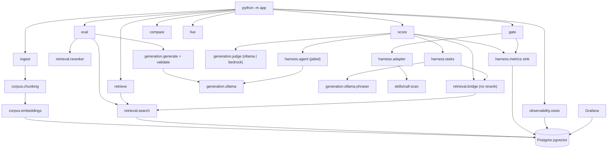

# Architecture

Map Writes the Test scores one task list three times (bare, map, map plus
retrieved rules) and stores every run for the Grafana board. The retrieval
exam path reuses the same search the harness bridge runs. Domain terms live
in `docs/prd.md`.

## Map

## Packages

- `app/corpus` — PDF conversion (`convert.py`), section chunking
  (`chunking.py`), embeddings (`embeddings.py`), and ingest (`ingest.py`),
  which replaces `policy_chunks` and stamps the embedding model on every row.
- `app/retrieval` — hybrid vector+keyword search fused by reciprocal rank
  (`retrieve.py`), the retrieve-only bridge the harness uses (`bridge.py`),
  and the cross-encoder reranker for the exam path (`reranker.py`).
- `app/generation` — the grounded answer path (`generate.py`, `validate.py`,
  `schemas.py`, `ollama.py`), the answer prompt
  (`prompts/policy_answer_v3.md`), and the judge adapters (`judge.py`):
  `OllamaJudgeAdapter` by default, `BedrockJudgeAdapter` when
  `JUDGE_PROVIDER=bedrock`.
- `app/harness` — the map and the scoreboard: graph loading and edge
  selection (`graph.py`), task generation (`tasks.py`), the jailed repo agent
  (`agent.py`), three-arm scoring (`score.py`), the repository gate
  (`gate.py`), the metrics sink (`metrics.py`), the golden retrieval exam
  (`evaluate.py`), and the tree chooser for the call-scan skill
  (`adapter.py`).
- `app/storage` — `db.py` protocol and `pgadapter.py` implementation.
- `app/observability` — OSSIE semantic-model validation against the live
  database.
- `app/web` — the compare page (`compare.py`) and the live trace page
  (`live.py`) with their static assets.
- `app/cli.py` + `app/config.py` — dispatch and pydantic-settings
  configuration anchored at the repository root.

## Runtime

`score` builds the task list from a graph file (tier 1 from map edges,
tier 2 phrased from bridge-retrieved corpus chunks), then runs the same list
bare, with the module diagram, and with the diagram plus the cited chunk
text. Tier 1 is a script check (symbol plus file); tier 2 is one judge call
that sees the reference chunk text and must cite one of their ids. The
`runs`, `task_results`, `tool_calls`, and `gate_metrics` tables carry
provenance (label, model, corpus, graph, task-list hash, origin) so the
board can tell runs apart. `gate` shells out to the call-scan skill on the
tree `app/harness/adapter.py` chooses. `python scripts/build_dashboard.py`
regenerates the committed Grafana board from code; `scripts/seed_runs.py`
writes labeled seeded runs through the real pipeline with stand-in agents.

## Out of scope for this cache

Ollama, boto3, and the Mermaid renderer `mmdc` are host tools, not modules.
The call-scan skill lives in this repo; Apache Fineract is the external
repository the adapter was written for (the committed demo tree mirrors its
loans package layout). Hugging Face supplies the embedding and reranker
weights at runtime.
