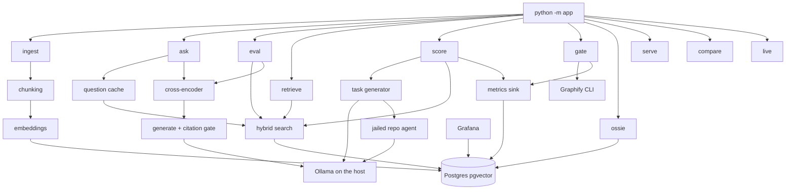

# Architecture

Mini RAG answers policy questions from Postgres/pgvector, and The Map Writes the Test scores the same task list three times (bare, map, map plus retrieved rules). Domain terms live in `docs/prd.md` and `docs/decision-log.md`.

## Map

## Packages

- `app` (`app/`): the only installable package (`pyproject.toml`). CLI dispatch is `app/cli.py`; storage is `app/pgadapter.py` behind `app/db.py`.
- Policy exam path (`app/retrieve.py`, `app/reranker.py`, `app/generate.py`, `app/evaluate.py`): hybrid search, rerank, grounded answer, ten-golden exam. This is old, and not part of eval harness. `python -m app eval` loads `eval/goldens.json` and runs each Minion question through the same search the ask path uses. Search reads `policy_chunks`.
- Map-writes-the-test path (`app/graph.py`, `app/tasks.py`, `app/agent.py`, `app/score.py`, `app/bridge.py`): Graphify graph in, three scored runs out. The bridge is retrieve-only and skips the reranker.
- Observability (`app/metrics.py`, `grafana/`, `app/ossie.py`): score and gate rows land in Postgres; Grafana reads them; OSSIE validates the declared tables.

## Runtime

An ask that misses the cache embeds the question (`app/embeddings.py`), fuses cosine and `tsvector` lanes with reciprocal rank fusion (`app/retrieve.py`), reranks with `cross-encoder/ms-marco-MiniLM-L-6-v2` (`app/reranker.py`), then asks Ollama for JSON (`app/ollama.py` → `POST /api/chat`) and keeps the answer only if `app/validate.py` accepts the citation. `score` builds tasks from a graph file, then runs a pydantic-ai agent jailed to a repository (`app/agent.py` uses Ollama's `/v1` base). `gate` shells out to the Graphify binary (`app/gate.py`).

## Out of scope for this cache

Ollama, the Graphify CLI (`graphifyy`), and the Mermaid renderer `mmdc` are host tools, not modules. Apache Fineract is an external repository the gate maps. Hugging Face supplies the embedding and reranker weights at runtime.
