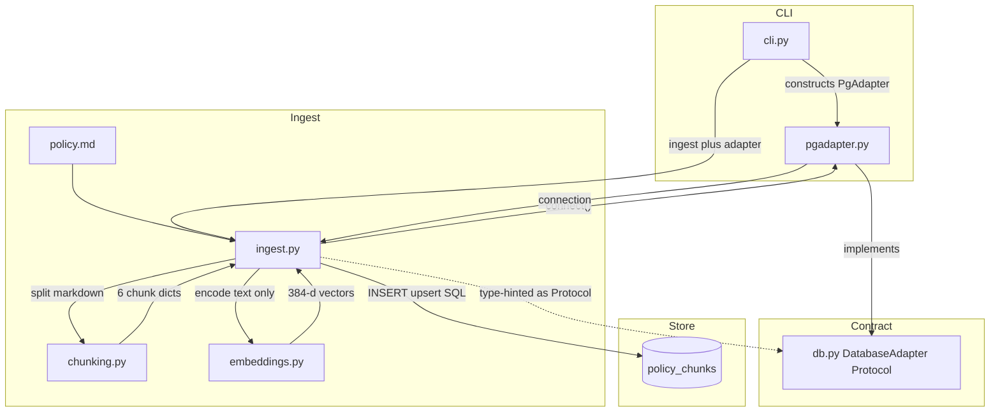
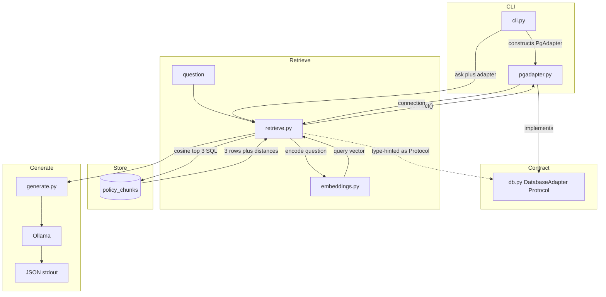
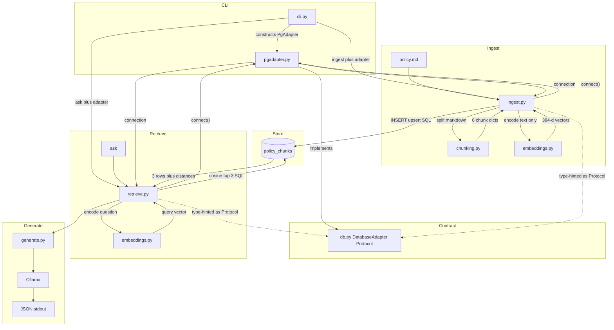

# Mini RAG: CLI, MiniLM, Ollama, pgvector

Replace the old FastAPI/OpenAI plan. This is the assignment build: a **Python CLI**, **local embeddings**, **Ollama chat**, **PostgreSQL/pgvector**. [`policy.md`](policy.md) already has the Version 2.0 policy.

**Stack**

- CLI: [`app/cli.py`](app/cli.py) via `python -m app ingest` | `ask` | `eval`
- Embeddings: `sentence-transformers` `all-MiniLM-L6-v2` (384-d), same model for ingest and ask
- Generation: Ollama `llama3.2:3b` (also pulled: `mistral`). Requires `ollama serve`
- Store: Postgres + pgvector, `ORDER BY embedding <=> :q ASC LIMIT 3`

No FastAPI. No OpenAI. [`app/cli.py`](app/cli.py) only dispatches; it does not read `policy.md` or run SQL.

## Architecture

[`app/db.py`](app/db.py) is a **`typing.Protocol`**. [`app/pgadapter.py`](app/pgadapter.py) implements it. Ingest and retrieve type-hint `DatabaseAdapter`, run their own SQL on the connection, and never import the driver. [`app/cli.py`](app/cli.py) constructs `PgAdapter` and passes it in.

Do **not** persist chunks before embedding. Do **not** put ingest/retrieve SQL on the Protocol or in `pgadapter.py`.

### 1. Ingest

[`app/ingest.py`](app/ingest.py) reads [`policy.md`](policy.md), calls [`app/chunking.py`](app/chunking.py), embeds **only** `chunk["text"]`, `connect()` on the adapter, then `INSERT`/`upsert` itself. No Ollama.



### 2. Retrieval

[`app/retrieve.py`](app/retrieve.py) embeds the question with the same MiniLM model, `connect()` on the adapter, runs cosine top-3 SQL itself, then [`app/generate.py`](app/generate.py) calls Ollama. It reads `policy_chunks`; it does not read `policy.md`.



### 3. Combined

Same Protocol, same `PgAdapter`, same `policy_chunks` table. Ingest writes; retrieve reads. CLI is the only place that constructs the adapter.



**pgvector scope:** store vectors and rank by cosine distance. It does not parse Markdown, run MiniLM, or write answers.

**HNSW:** optional learning only (`USING hnsw (embedding vector_cosine_ops)`). Graded `ask` uses exact `<=>` (flat scan). Six rows do not need ANN.

## Layout

```
mini-rag/
  policy.md
  README.md
  docker-compose.yml
  .env.example
  requirements.txt
  sql/001_init.sql
  app/
    __init__.py
    __main__.py          # python -m app → cli
    cli.py               # ingest | ask | eval
    config.py
    db.py                # DatabaseAdapter Protocol only
    pgadapter.py         # implements Protocol: connect, register vector, return conn
    chunking.py          # called only by ingest.py
    embeddings.py
    ingest.py            # reads policy.md, chunks, embeds, SQL on adapter conn
    retrieve.py
    generate.py
    schemas.py
  tests/test_rag.py
  tests/output.json
```

## Implementation

**Ingest** ([`app/ingest.py`](app/ingest.py)): reads [`policy.md`](policy.md) from disk. Calls [`app/chunking.py`](app/chunking.py) with the markdown string. Embeds `chunk["text"]` only via [`app/embeddings.py`](app/embeddings.py). Takes a `DatabaseAdapter`, calls `connect()`, then runs upsert SQL on that connection. Asserts `COUNT(*) = 6`. No Ollama. No import of `psycopg` / pgvector.

**Chunking** ([`app/chunking.py`](app/chunking.py)): pure function, `split(markdown) -> list[dict]`. Split on `## (\d+)\. (.+)$`. Exactly six chunks; do not cut sentences. IDs like `expense-policy:v2.0:section-1`. Parse title/version from the H1. Does not read files or touch Postgres.

**Protocol** ([`app/db.py`](app/db.py)): `class DatabaseAdapter(Protocol)` with `connect()` (context manager or conn + `close()`). Documents that the connection must accept Python lists as `vector(384)` bind params. No Postgres imports, no SQL.

**PgAdapter** ([`app/pgadapter.py`](app/pgadapter.py)): `class PgAdapter:` structurally implements `DatabaseAdapter`. Connects with `DATABASE_URL`, registers pgvector, returns the connection. No ingest/retrieve business SQL.

**Wiring:** [`app/cli.py`](app/cli.py) does `ingest.run(PgAdapter())` and `retrieve.search(..., PgAdapter())`.

**Embeddings** ([`app/embeddings.py`](app/embeddings.py)): MiniLM, `normalize_embeddings=True`, store the full 384-float vector. Ollama is not used for embeddings.

**Schema** (`vector(384)`): `chunk_id`, `document`, `version`, `section`, `section_title`, `text`, `embedding`. Upsert on `chunk_id`, issued by ingest.py.

**`python -m app ingest`:** [`app/cli.py`](app/cli.py) calls `ingest.run()`. No Ollama.

**`python -m app ask "..."`:** [`app/retrieve.py`](app/retrieve.py) embeds the question, `connect()` on the `DatabaseAdapter`, and runs cosine top-3 SQL itself (numeric distances). Then Ollama `/api/chat` (`format: json`, temperature 0). `retrieved_chunks` always from that SQL. Citation from row metadata (`"1. Meals"`) or `null` if refuse / section not in retrieved set.

**`python -m app eval`:** all six required questions → [`tests/output.json`](tests/output.json).

**Tests:** chunk count/metadata; cosine ascending and limit 3; expected section in top-3 for at least five questions; gym refusal with no citation.

## Six questions

- food each day → §1 Meals, $65, citation
- first-class airfare → §3 Airfare, economy / VP for business, citation
- hotel $250 → §2 Hotels, manager approval before booking, citation
- $20 taxi receipt → §5 Receipts, no receipt under $25, citation
- limousine upgrade → §4 Ground Transportation, luxury not reimbursable, citation
- gym memberships → refuse: `The provided policy does not answer this question.` No citation

## Run (README)

1. `ollama serve`
2. `docker compose up -d` (Postgres 16 + pgvector)
3. Apply [`sql/001_init.sql`](sql/001_init.sql)
4. `.env`: `DATABASE_URL`, `EMBEDDING_MODEL=all-MiniLM-L6-v2`, `OLLAMA_MODEL=llama3.2:3b`
5. `pip install -r requirements.txt`
6. `python -m app ingest`
7. `python -m app ask "How much can I spend on food each day?"`
8. `python -m app eval` and `pytest`

## Out of scope

FastAPI, OpenAI, Ollama embeddings, keyword search, whole-document embedding, truncated vectors, LLM-invented citations, ANN as the graded path.
